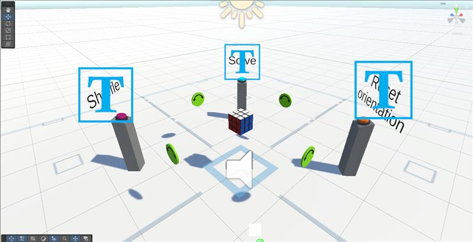

# DESCRIPTION
Rubik's cube for VR made in Unity3D with us eof SteamVR plugin.

## Functionality
- Each side of cube can be rotated.\
- Green disks can be rotated to rotate cube and get access to for example bottom side.\
- 3 buttons - shuffle, solve, reset orientation (should be self explanatory)\

## Controls
(Controls description for Vive Pro 2 headset)
- triggers - grabbing and rotating
- big middle button - teleport
- buttons on the scene can be just pressed by colliding with them